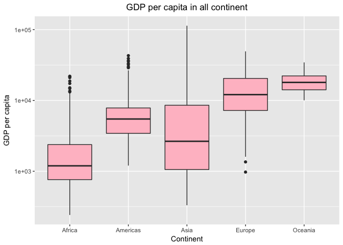

Homework3: Gapminder dataset manipulation and exploration using dplyr/ggplot2
================
Jummy David
October 2, 2018

-   [\`\`\`{r}](#r)
-   [library(knitr)](#libraryknitr)
-   [library(kableExtra)](#librarykableextra)
-   [\`\`\`](#section)
    -   [TASK1: Get the maximum and minimum of GDP per capita for all continents:](#task1-get-the-maximum-and-minimum-of-gdp-per-capita-for-all-continents)
    -   [TASK2: Look at the spread of GDP per capita within the continents](#task2-look-at-the-spread-of-gdp-per-capita-within-the-continents)
    -   [TASK3: Compute a trimmed mean of life expectancy for different years. Or a weighted mean, weighting by population. Just try something other than the plain vanilla mean:](#task3-compute-a-trimmed-mean-of-life-expectancy-for-different-years.-or-a-weighted-mean-weighting-by-population.-just-try-something-other-than-the-plain-vanilla-mean)
    -   [TASK4: How is life expectancy changing over time on different continents?:](#task4-how-is-life-expectancy-changing-over-time-on-different-continents)
    -   [TASK5: Report the absolute and/or relative abundance of countries with low life expectancy over time by continent: Compute some measure of worldwide life expectancy – you decide – a mean or median or some other quantile or perhaps your current age. Then determine how many countries on each continent have a life expectancy less than this benchmark, for each year.](#task5-report-the-absolute-andor-relative-abundance-of-countries-with-low-life-expectancy-over-time-by-continent-compute-some-measure-of-worldwide-life-expectancy-you-decide-a-mean-or-median-or-some-other-quantile-or-perhaps-your-current-age.-then-determine-how-many-countries-on-each-continent-have-a-life-expectancy-less-than-this-benchmark-for-each-year.)
    -   [But I want to do more: Combine table and figures from task 1.](#but-i-want-to-do-more-combine-table-and-figures-from-task-1.)
    -   [References:](#references)

In this homework, we will manipulate the gapminder dataset and explore different variables. To start with, load the `tidyverse` and `gapminder` R packages in a suppressed format.

``` r
suppressPackageStartupMessages(library(tidyverse))
```

    ## Warning: package 'ggplot2' was built under R version 3.3.2

    ## Warning: package 'readr' was built under R version 3.3.2

    ## Warning: package 'purrr' was built under R version 3.3.2

    ## Warning: package 'dplyr' was built under R version 3.3.2

``` r
suppressPackageStartupMessages(library(gapminder))
```

    ## Warning: package 'gapminder' was built under R version 3.3.2

Install `knitr` and `kable` packages to have a more readable, fancy and better table.

\`\`\`{r}
=========

library(knitr)
==============

library(kableExtra)
===================

\`\`\`
======

TASK1: Get the maximum and minimum of GDP per capita for all continents:
------------------------------------------------------------------------

Create a copy of the gapminder data and call it `Gap` so as to be sure the original gapminder dataset is kept intact.

``` r
Gap <- gapminder
```

Group by continent and summarise the minimum and the maximum GDP per capita using a table.

``` r
A1 <- Gap %>%
  group_by(continent) %>%
  summarize(min_GDP = min(gdpPercap), max_GDP = max(gdpPercap))

knitr::kable(A1) #the chunk code here makes table A1 look nicer and better.
```

| continent |    min\_GDP|   max\_GDP|
|:----------|-----------:|----------:|
| Africa    |    241.1659|   21951.21|
| Americas  |   1201.6372|   42951.65|
| Asia      |    331.0000|  113523.13|
| Europe    |    973.5332|   49357.19|
| Oceania   |  10039.5956|   34435.37|

Here we install and load the library `gridExtra` where I will be calling the function `grid.arrange`.

``` r
library(gridExtra)
```

    ## Warning: package 'gridExtra' was built under R version 3.3.2

    ## 
    ## Attaching package: 'gridExtra'

    ## The following object is masked from 'package:dplyr':
    ## 
    ##     combine

Here we have a barplot of the maximum and minimum GDP per capita which represents our observations from the table. The command `geom_col` gives a barplot by continents. And the upper plot (minimum GDP per capita) shows that Oceania has the highest minimum GDP while Africa has the lowest GDP. Also, the lower plot (maximum GDP per capita) shows that Asia has the highest maximum GDP and Africa still has the lowest maximum GDP. Here, I tried to use `stat=identity` and `position=dodge` but it was giving error, so I decided to use `grid.arrange`.

``` r
Min_plot <- A1 %>%
  ggplot(aes(continent, min_GDP, fill = continent)) +
  geom_col() +
  labs(x="Continent", y = "Minimum GDP per capita") +
  ggtitle(" Minimum GDP per capita by continents")+theme(plot.title = element_text(hjust = 0.5))


Max_plot <- A1 %>%
  ggplot(aes(continent, max_GDP, fill = continent)) +
  geom_col() +
  labs(x="Continent", y = "Maximum GDP per capita") + #used to label the x and y axis and as well the title of the plot.
  ggtitle("Maximum GDP per capita by continents")+theme(plot.title = element_text(hjust = 0.5))

  

grid.arrange(Min_plot, Max_plot) #The code here is to put both plots on a page for better comparison.
```


Here I made a table of the minimum and maximum GDPpercap and group by continent and year.

``` r
A11 <- Gap %>%
  group_by(continent,year) %>%
  summarize(min_GDP = min(gdpPercap), max_GDP = max(gdpPercap)) 
  
  
  A11 %>% head(10) %>% knitr::kable() #The code here is to view the first 10 rows.
```

| continent |  year|  min\_GDP|   max\_GDP|
|:----------|-----:|---------:|----------:|
| Africa    |  1952|  298.8462|   4725.296|
| Africa    |  1957|  335.9971|   5487.104|
| Africa    |  1962|  355.2032|   6757.031|
| Africa    |  1967|  412.9775|  18772.752|
| Africa    |  1972|  464.0995|  21011.497|
| Africa    |  1977|  502.3197|  21951.212|
| Africa    |  1982|  462.2114|  17364.275|
| Africa    |  1987|  389.8762|  11864.408|
| Africa    |  1992|  410.8968|  13522.158|
| Africa    |  1997|  312.1884|  14722.842|

Plots of minimum GDP per capita for different continent through all years. I initially used `grid.arrange` but it was hard to distinguish the lines for different continents in both plots. So I decided to have them separate. We see here that through out the years, Oceania seems to have the highest minimum GDP per capita which increases almost every year, followed by Europe. African seems to have the lowest minimum with no significant increase.

``` r
A11 %>%
  ggplot(aes(year, min_GDP, shape = continent, colour = continent)) +
  geom_point() +
  geom_line() +
  scale_y_log10() +
  labs(x="Years", y = "Minimum GDP per capita") +
  ggtitle("Minimum gdpPercap for different continents through all the years")+theme(plot.title = element_text(hjust = 0.5))
```


Plots of maximum GDP per capita for different continent through all years. We see here that Asia has the highest maximum GDP per capita at the early years and then decreases below that of Eorope. Oceania's GDP seems stable througout the years, while Africa increases at the early years and then decreses to the least maximum.

``` r
A11 %>%
  ggplot(aes(year, max_GDP, shape = continent, colour = continent)) +
  geom_point() +
  geom_line() +
  scale_y_log10() + #used for rescaling
  labs(x="Years", y = "Maximum GDP per capita") +
  ggtitle("Maximum gdpPercap for different continents through all the years")+theme(plot.title = element_text(hjust = 0.5))
```


TASK2: Look at the spread of GDP per capita within the continents
-----------------------------------------------------------------

The table here shows the spread of GDP per capita within each continents. The command `summarize` is used to solve for different statistical measure of spread.

``` r
C1 <- Gap %>%
  group_by(continent) %>%
  summarize(min_GDP = min(gdpPercap), mean_GDP = mean(gdpPercap), Var_GDP = var(gdpPercap), SD_GDP = sd(gdpPercap), IQR = IQR(gdpPercap), First_Q = quantile(gdpPercap, 0.25), Third_Q = quantile(gdpPercap, 0.75), max_GDP = max(gdpPercap))
```

    ## Warning: package 'bindrcpp' was built under R version 3.3.2

``` r
knitr::kable(C1) #%>% #the code here is used to make a fancy table
```

| continent |    min\_GDP|  mean\_GDP|   Var\_GDP|    SD\_GDP|        IQR|   First\_Q|   Third\_Q|   max\_GDP|
|:----------|-----------:|----------:|----------:|----------:|----------:|----------:|----------:|----------:|
| Africa    |    241.1659|   2193.755|    7997187|   2827.930|   1616.170|    761.247|   2377.417|   21951.21|
| Americas  |   1201.6372|   7136.110|   40918591|   6396.764|   4402.431|   3427.779|   7830.210|   42951.65|
| Asia      |    331.0000|   7902.150|  197272506|  14045.373|   7492.262|   1056.993|   8549.256|  113523.13|
| Europe    |    973.5332|  14469.476|   87520020|   9355.213|  13248.301|   7213.085|  20461.386|   49357.19|
| Oceania   |  10039.5956|  18621.609|   40436669|   6358.983|   8072.258|  14141.859|  22214.117|   34435.37|

``` r
  #kable_styling(bootstrap_options = "striped", full_width = F) ##the code here is used to change the stle of the table and reduce from full size.
```

Here we have the distribution of the spread of GDP per capita. We need to install the `gridExtra` package here before we can use `grid.arrange`. I made a barplot of each of the measures and used `grid.arrange` command to put them on a plot. We can see here that the `Mean`, `First quantile` and `second quantile` are highest in Oceania followed by Europe. While has the highest `standard deviation` and `variance`.

``` r
One <- C1 %>%
  ggplot(aes(continent, mean_GDP, fill = continent)) +
  geom_col() +
  labs(x="Continent", y = "Mean")
Two <- C1 %>%
  ggplot(aes(continent, Var_GDP, fill = continent)) +
  geom_col() +
  labs(x="Continent", y = "Variance")
Three <- C1  %>%
  ggplot(aes(continent, SD_GDP, fill = continent)) +
  geom_col() +
  labs(x="Continent", y = "Standard deviation")

Four <- C1 %>%
  ggplot(aes(continent, IQR, fill = continent)) +
  geom_col() +
  labs(x="Continent", y = "Interquartile range")

Five <- C1 %>%
  ggplot(aes(continent, First_Q, fill = continent)) +
  geom_col() +
  labs(x="Continent", y = "First quantile")

Six <-C1 %>%
  ggplot(aes(continent, Third_Q, fill = continent)) +
  geom_col() +
  labs(x="Continent", y = "Third quantile")

grid.arrange(One, Two, Three, Four, Five, Six, nrow = 3) #the chunk code here is to put all of my plots on a single page.
```


Here we have the spread of GDP per capita for different continents. We have represented the spread here with `geom_point` which I showed in different colour the different measure of spread. I used `geom_point` to add all of the plot together, `log scale`, colour each measure differently and then label. Here we see that Africa which happens to be my continent has the lowest minimum GDP and variance. Asia has the highest variance.

``` r
C1 %>%
  ggplot() +
  geom_point(aes(continent, min_GDP, colour = "Minimum GDP")) +
  geom_point(aes(continent, mean_GDP, colour = "Mean GDP")) +
  geom_point(aes(continent, Var_GDP, colour = "GDP variance")) +
  geom_point(aes(continent, SD_GDP, colour = "GDP standard deviation")) +
  geom_point(aes(continent, IQR, colour = "GDP Interquartile range")) +
  geom_point(aes(continent, First_Q, colour = "GDP first quantile")) +
  geom_point(aes(continent, Third_Q, colour = "GDP third quantile")) +
  geom_point(aes(continent, max_GDP, colour = "Maximum GDP")) +
  scale_y_log10() +
  labs(x="Continent", y="Spread of GDP per capita") +
  ggtitle("The Spread of GDP per capita for different continents")+theme(plot.title = element_text(hjust = 0.5))
```


Here we see the distribution of GDP per capita for different continents. We `grouped` by continent, make a histogram using the command `geom_histogram` and then split into different continent using the command `facet wrap`. The command `facet_wrap` is used to make separate histograms for each continent. The command `scales  = free` is used to make each continent have their own distinct x and y axis. We can see here that Africa has the highest count of gdpPercap. We can clearly see that Africa has the highest distribution of GDP per capita followed by Asia, with Oceania being the lowest.

``` r
gapminder %>%
  group_by(continent) %>%
  ggplot(aes(x=gdpPercap, fill = continent)) +
  geom_histogram(colour = 'black')+
  facet_wrap(~continent, scales = "free") +
  labs(x="GDP per capita", y = "Count") +
  ggtitle("Distrubution of GDP per capita for different continents")+theme(plot.title = element_text(hjust = 0.5))
```

    ## `stat_bin()` using `bins = 30`. Pick better value with `binwidth`.


Here, I show the boxplot of gdpPercap among all continent using pink colour. I also use the `ggtitle` to specify the title of the plot. This shows that Oceania has the highest gdpPercap, while Africa has the lowest. We also rescaled by using the command `scale_y_log10` to see a clearer difference between the boxplots.

``` r
ggplot(aes(x = continent, y = gdpPercap), data =gapminder) +
  scale_y_log10() +
geom_boxplot(fill = "pink") +
  labs(x="Continent", y = "GDP per capita") +
ggtitle("GDP per capita in all continent")+theme(plot.title = element_text(hjust = 0.5))
```



Similarly, this is a violin plot using the command `geom_violin` as well as rescaling to show the distribution of gdpPercap in each continent. We also see here that Oceania have higher gdpPercap and Africa have the lowest.

``` r
ggplot(gapminder, aes(continent, gdpPercap)) +
  scale_y_log10() +
  geom_violin(fill = "pink") +
  labs(x="Continent", y = "GDP per capita") +
  ggtitle("Distrubution of GDP per capita for all continents using violin plot")+theme(plot.title = element_text(hjust = 0.5))
```


This is a violin plot with jitter plot using the command `geom_jitter`. It also shows the distribution of gdpPercap in each continent. I rescaled here as well.

``` r
ggplot(gapminder, aes(continent, gdpPercap)) +
  scale_y_log10() +
  geom_jitter(alpha=0.3) +
  labs(x="Continent", y = "GDP per capita") +
  ggtitle("Distrubution of GDP per capita for all continents using jitter plot")+theme(plot.title = element_text(hjust = 0.5))
```


TASK3: Compute a trimmed mean of life expectancy for different years. Or a weighted mean, weighting by population. Just try something other than the plain vanilla mean:
------------------------------------------------------------------------------------------------------------------------------------------------------------------------

The table here has three colums of the normal mean life expectancy (Vanilla mean) and the weighted mean. We grouped by year and summarized. I noticed here that when I mistakingly typed `summarise` it worked perfectly as `summarize` would. From the table below, we see the total mean and weighted mean life expectancy for all years.

``` r
D1 <- Gap %>%
  group_by(year) %>%
  summarize(Mean_lifeExp = mean(lifeExp), Weighted_mean_lifeExp = weighted.mean(lifeExp, pop)) 

D1 %>% knitr::kable() #to have a better and a more readable table
```

|  year|  Mean\_lifeExp|  Weighted\_mean\_lifeExp|
|-----:|--------------:|------------------------:|
|  1952|       49.05762|                 48.94424|
|  1957|       51.50740|                 52.12189|
|  1962|       53.60925|                 52.32438|
|  1967|       55.67829|                 56.98431|
|  1972|       57.64739|                 59.51478|
|  1977|       59.57016|                 61.23726|
|  1982|       61.53320|                 62.88176|
|  1987|       63.21261|                 64.41635|
|  1992|       64.16034|                 65.64590|
|  1997|       65.01468|                 66.84934|
|  2002|       65.69492|                 67.83904|
|  2007|       67.00742|                 68.91909|

The figure here represents our table above. I used the command `geom_line` and `geom_point` to add the lines on a plot. We see here that both means started at the same point, then the weighted mean increased above vanilla mean. Something interesting seems to happen shortly before after year 1960.

``` r
D1 %>%
  ggplot() +
  geom_point(aes(year, Mean_lifeExp, colour = "Vanilla mean")) +
  geom_line(aes(year, Mean_lifeExp, colour = "Vanilla mean")) +
  geom_point(aes(year, Weighted_mean_lifeExp, colour = "Weighted mean")) +
  geom_line(aes(year, Weighted_mean_lifeExp, colour = "Weighted mean")) +
  labs(x="Year", y="Mean life expectancy") +
  ggtitle("Mean life expectancy for different years")+theme(plot.title = element_text(hjust = 0.5))
```


TASK4: How is life expectancy changing over time on different continents?:
--------------------------------------------------------------------------

Here I grouped the table by continent and year, then summarize the mean life expectancy using the command `summarize`. I also used the `head` command to view just the first 6 rows, then used the `knitr::kable` command to make the table look good.

``` r
Change_Gap <- Gap %>%
  group_by(continent, year) %>%
  summarize(mean_lifeExp = mean(lifeExp))

Change <- Change_Gap %>% head() %>%
  knitr::kable()
Change
```

| continent |  year|  mean\_lifeExp|
|:----------|-----:|--------------:|
| Africa    |  1952|       39.13550|
| Africa    |  1957|       41.26635|
| Africa    |  1962|       43.31944|
| Africa    |  1967|       45.33454|
| Africa    |  1972|       47.45094|
| Africa    |  1977|       49.58042|

Here, we have a line plot that shows the change in life expectancy for different continents in all the years. We see that Oceania has the highest mean life expectancy, followed by Europe and with Africa being the lowest for all years.

``` r
Change_Gap %>% 
  ggplot(aes(year, mean_lifeExp, colour = continent)) + #the chunk code here is used to plot the mean life expectancy versus year, coloured by different continent.
  geom_point() + #all the data point for different years
  geom_line() + #Put lines across the points.
  labs(x="Year", y="Mean life expectancy") +
  ggtitle("Change in life expectancy among all continents in all years")+theme(plot.title = element_text(hjust = 0.5))
```


We have the same plot as above, but here I showed how the command `facet_wrap` can be used to separate by continents. And we have the mean life expectancy of different continents across all years.

``` r
 Change_Gap %>% 
  ggplot(aes(year, mean_lifeExp, colour = continent)) + 
  geom_point() +
  geom_line() +
  facet_wrap(~continent, scales = "free") +
  labs(x="Year", y="Mean life expectancy") +
  ggtitle("Change in life expectancy among all continents in all years")+theme(plot.title = element_text(hjust = 0.5))
```


The plot of the life expectancy of all continents in all years. We plot life expectancy here to show its spread among all continents and also use the command `facet_wrap` as used in the previous plots.

``` r
Gap %>% 
  ggplot(aes(year, lifeExp, colour = continent)) + 
  geom_point() +
  geom_line() +
  facet_wrap(~continent, scales = "free")+
  labs(x="Year", y="Life expectancy") +
  ggtitle("Life expectancy among all continents in all years")+theme(plot.title = element_text(hjust = 0.5))
```


Here we have density plots to also show the spread of life expectancy versus continent stratified by year. We have the density of the life expectancy of all continents on a plots and make these plots for different years. We controlled our colour a bit here to make the density plot of diferent continents visible. We can see that throughout the years, Oceania seems to have the highest density, followed by Europe.

``` r
Gap %>% 
ggplot(aes(x = lifeExp, fill = continent)) +
  facet_wrap(~year) + geom_density(alpha = 0.3) + ggtitle("Density plots of life expectancy for each continents and in all years") + theme(legend.title = element_text(color = "black", size = 14, face = "bold"), legend.background = element_rect(fill = "gray80",size = 0.2, linetype = "dashed")) + labs(x="Life expectancy", y="Density")+scale_fill_manual( values = c("orange","blue","maroon","darkgreen","midnightblue"))
```


TASK5: Report the absolute and/or relative abundance of countries with low life expectancy over time by continent: Compute some measure of worldwide life expectancy – you decide – a mean or median or some other quantile or perhaps your current age. Then determine how many countries on each continent have a life expectancy less than this benchmark, for each year.
----------------------------------------------------------------------------------------------------------------------------------------------------------------------------------------------------------------------------------------------------------------------------------------------------------------------------------------------------------------------------

The table here is used to show different measure of the world life expectancy. The command `knitr::kable` is used as above while the command `kable_styling` is used for styling and spacing the table. The table is shrink to readable size when `full_width =F` is specified.

``` r
World_lex <- Gap %>%
  group_by(year) %>%
  summarize(min_lifeExp = min(lifeExp), mean_lifeExp = mean(lifeExp), Var_lifeExp = var(lifeExp), SD_lifeExp = sd(lifeExp), IQR = IQR(lifeExp), First_Q_lifeExp = quantile(lifeExp, 0.25), Third_Q_lifeExp = quantile(lifeExp, 0.75), max_GDP = max(lifeExp))

knitr::kable(World_lex) #%>%
```

|  year|  min\_lifeExp|  mean\_lifeExp|  Var\_lifeExp|  SD\_lifeExp|       IQR|  First\_Q\_lifeExp|  Third\_Q\_lifeExp|  max\_GDP|
|-----:|-------------:|--------------:|-------------:|------------:|---------:|------------------:|------------------:|---------:|
|  1952|        28.801|       49.05762|      149.4740|     12.22596|  20.70600|           39.05900|           59.76500|    72.670|
|  1957|        30.332|       51.50740|      149.6044|     12.23129|  21.78925|           41.24750|           63.03675|    73.470|
|  1962|        31.997|       53.60925|      146.3433|     12.09724|  21.76600|           43.46850|           65.23450|    73.680|
|  1967|        34.020|       55.67829|      137.3316|     11.71886|  21.38575|           46.03375|           67.41950|    74.160|
|  1972|        35.400|       57.64739|      129.5489|     11.38195|  20.74725|           48.50025|           69.24750|    74.720|
|  1977|        31.220|       59.57016|      126.0507|     11.22723|  19.90700|           50.47550|           70.38250|    76.110|
|  1982|        38.445|       61.53320|      116.0062|     10.77062|  17.98125|           52.94000|           70.92125|    77.110|
|  1987|        39.906|       63.21261|      111.4352|     10.55629|  16.93650|           54.94075|           71.87725|    78.670|
|  1992|        23.599|       64.16034|      126.0541|     11.22738|  16.46075|           56.12175|           72.58250|    79.360|
|  1997|        36.087|       65.01468|      133.6206|     11.55944|  18.53600|           55.63375|           74.16975|    80.690|
|  2002|        39.193|       65.69492|      150.7940|     12.27982|  19.93700|           55.52225|           75.45925|    82.000|
|  2007|        39.613|       67.00742|      145.7578|     12.07302|  19.25300|           57.16025|           76.41325|    82.603|

``` r
  #kable_styling(bootstrap_options = "striped", full_width = F)
```

The table here gives the percentage of countries with low life expectancy in each continent over time. We see that in 1952, 96% of countries in African experienced low life expectancy. We also note that Oceania have no low life expectancy through all years.

``` r
(rbench = round(mean(World_lex$First_Q_lifeExp))) #Here I made the first quantile life expectancy my benchmark 
```

    ## [1] 50

``` r
Low_lifeExp <-Gap %>%
  group_by(continent, year) %>%
  summarize(Low_Exp_percent = round(sum(lifeExp < rbench)/length(lifeExp),2)) %>% #The chunk code here filter those with life expectancy lower than the benchmark and generate the result in percentage. 
  arrange(year) #I arranged by year.

knitr::kable(Low_lifeExp) 
```

| continent |  year|  Low\_Exp\_percent|
|:----------|-----:|------------------:|
| Africa    |  1952|               0.96|
| Americas  |  1952|               0.36|
| Asia      |  1952|               0.67|
| Europe    |  1952|               0.03|
| Oceania   |  1952|               0.00|
| Africa    |  1957|               0.94|
| Americas  |  1957|               0.32|
| Asia      |  1957|               0.55|
| Europe    |  1957|               0.03|
| Oceania   |  1957|               0.00|
| Africa    |  1962|               0.90|
| Americas  |  1962|               0.24|
| Asia      |  1962|               0.52|
| Europe    |  1962|               0.00|
| Oceania   |  1962|               0.00|
| Africa    |  1967|               0.75|
| Americas  |  1967|               0.08|
| Asia      |  1967|               0.36|
| Europe    |  1967|               0.00|
| Oceania   |  1967|               0.00|
| Africa    |  1972|               0.69|
| Americas  |  1972|               0.08|
| Asia      |  1972|               0.18|
| Europe    |  1972|               0.00|
| Oceania   |  1972|               0.00|
| Africa    |  1977|               0.54|
| Americas  |  1977|               0.04|
| Asia      |  1977|               0.15|
| Europe    |  1977|               0.00|
| Oceania   |  1977|               0.00|
| Africa    |  1982|               0.46|
| Americas  |  1982|               0.00|
| Asia      |  1982|               0.09|
| Europe    |  1982|               0.00|
| Oceania   |  1982|               0.00|
| Africa    |  1987|               0.38|
| Americas  |  1987|               0.00|
| Asia      |  1987|               0.03|
| Europe    |  1987|               0.00|
| Oceania   |  1987|               0.00|
| Africa    |  1992|               0.38|
| Americas  |  1992|               0.00|
| Asia      |  1992|               0.03|
| Europe    |  1992|               0.00|
| Oceania   |  1992|               0.00|
| Africa    |  1997|               0.38|
| Americas  |  1997|               0.00|
| Asia      |  1997|               0.03|
| Europe    |  1997|               0.00|
| Oceania   |  1997|               0.00|
| Africa    |  2002|               0.42|
| Americas  |  2002|               0.00|
| Asia      |  2002|               0.03|
| Europe    |  2002|               0.00|
| Oceania   |  2002|               0.00|
| Africa    |  2007|               0.35|
| Americas  |  2007|               0.00|
| Asia      |  2007|               0.03|
| Europe    |  2007|               0.00|
| Oceania   |  2007|               0.00|

The line plot here shows a similar information as the table above. Oceania's low life expectancy is zero for all years. Africa have the highest low life expectancy, then decreases over the years to around 40%. Americas life expectancy was also low initial but decreases to zero over the years.

``` r
Low_lifeExp %>% 
  ggplot(aes(year, Low_Exp_percent, colour = continent)) + 
  geom_point() +
  geom_line() +
  labs(x="Year", y="Low life expectancy") +
  ggtitle("Percentage of continents with low life expectancy over time")+theme(plot.title = element_text(hjust = 0.5))
```


Here I used the command `facet_wrap` to view different continents separately so as to see obvious difference between the continents.

``` r
Low_lifeExp %>% 
  ggplot(aes(year, Low_Exp_percent, colour = continent)) + 
  geom_point() +
  geom_line() +
  facet_wrap(~continent) +
  labs(x="Year", y="Low life expectancy") +
     ggtitle("Percentage of continents with low life expectancy over time")+theme(plot.title = element_text(hjust = 0.5))
```


But I want to do more: Combine table and figures from task 1.
-------------------------------------------------------------

Here I am combining table and figure. I first use the command `tableGrob` to transform the table into a Grob.

``` r
A1_Grob <- tableGrob(A1, theme=ttheme_minimal(), rows=NULL)
grid.arrange(A1_Grob, Min_plot, Max_plot, nrow=2)
```


References:
-----------

[Rbloggers](%22https://www.r-bloggers.com/data-visualization-in-r-using-ggplot2/%22)
